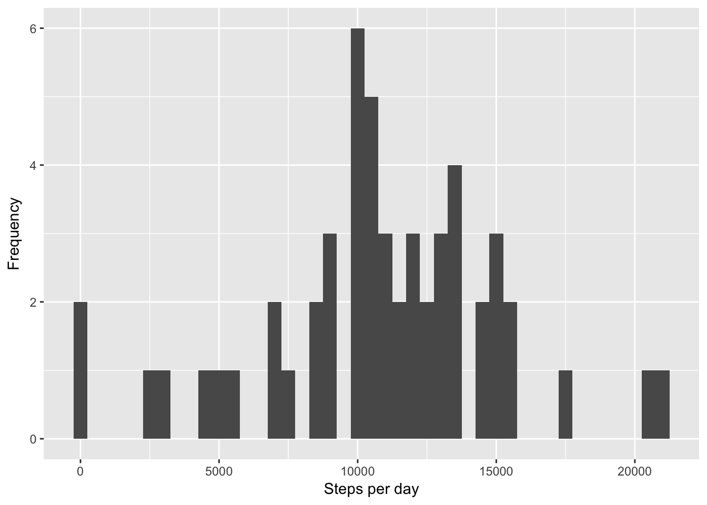
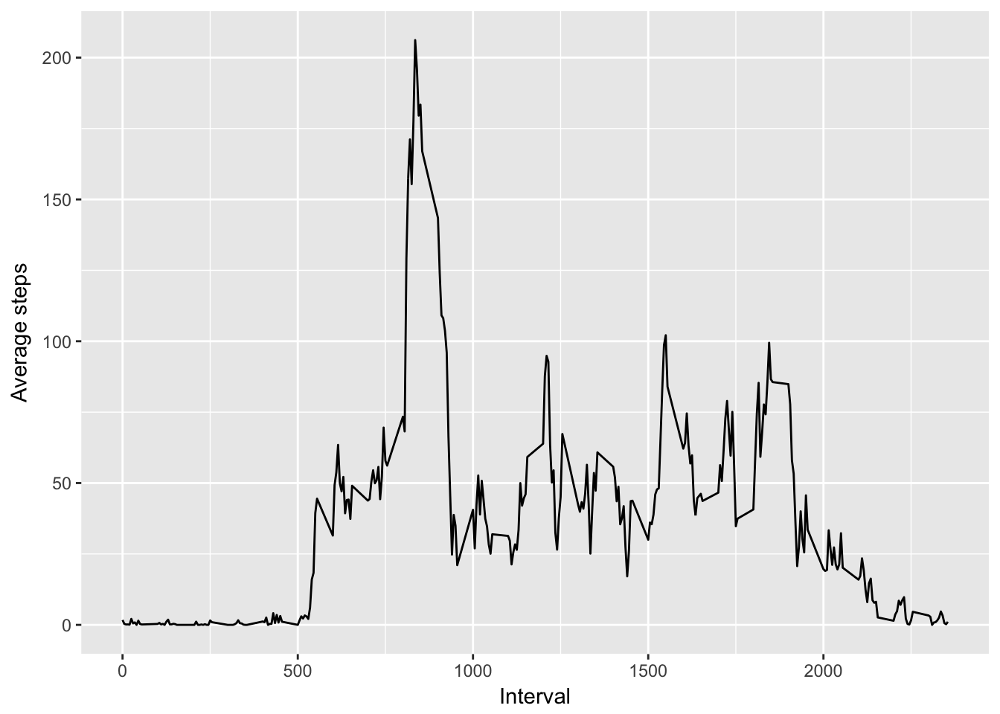
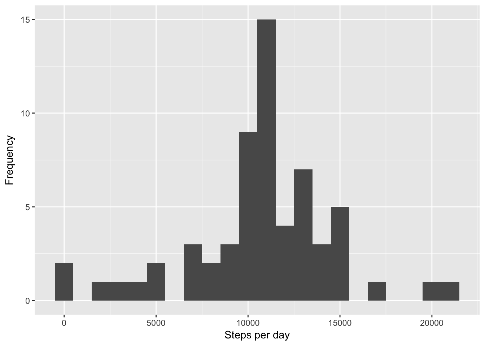
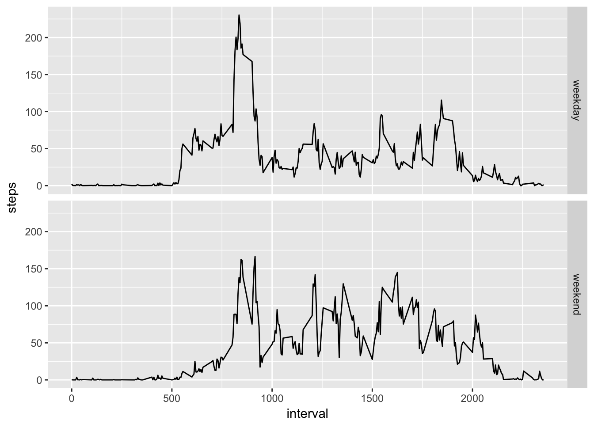

Final project
-------------

**Commit containing full submission**

1.  Code for reading in the dataset and/or processing the data
2.  Histogram of the total number of steps taken each day
3.  Mean and median number of steps taken each day
4.  Time series plot of the average number of steps taken
5.  The 5-minute interval that, on average, contains the maximum number
    of steps
6.  Code to describe and show a strategy for imputing missing data
7.  Histogram of the total number of steps taken each day after missing
    values are imputed
8.  Panel plot comparing the average number of steps taken per 5-minute
    interval across weekdays and weekends
9.  All of the R code needed to reproduce the results (numbers,
    plots, etc.) in the report

Loading and preprocessing the data
----------------------------------

1.  Load the data (i.e. read.csv)
2.  Process/transform the data (if necessary) into a format suitable for
    your analysis

<!-- -->

    # Code for reading in the dataset and/or processing the data
    raw <- read.csv('activity.csv')
    # removing missing data
    cleandata <- raw[complete.cases(raw),]

What is mean total number of steps taken per day?
-------------------------------------------------

For this part of the assignment, you can ignore the missing values in
the dataset.

1.  Calculate the total number of steps taken per day
2.  If you do not understand the difference between a histogram and a
    barplot, research the difference between them. Make a histogram of
    the total number of steps taken each day
3.  Calculate and report the mean and median of the total number of
    steps taken per day

<!-- -->

    # Calculate the total number of steps taken per day
    stepsPerDay <- aggregate(steps ~ date, cleandata, sum, na.action = na.omit)
    # Histogram of the total number of steps taken each day
    qplot(stepsPerDay$steps, binwidth = 500, ylab = 'Frequency',  xlab = "Steps per day")

    # Mean and median number of steps taken each day
    meanSteps <- mean(stepsPerDay$steps)
    medianSteps <- median(stepsPerDay$steps)

**Answer:** The mean of the total number of steps taken per day is
10766.19 and the median is 10765.

What is the average daily activity pattern?
-------------------------------------------

1.  Make a time series plot of the 5-minute interval (x-axis) and the
    average number of steps taken, averaged across all days (y-axis)
2.  Which 5-minute interval, on average across all the days in the
    dataset, contains the maximum number of steps?

<!-- -->

    # Time series plot of the average number of steps taken
    meanInterval <- aggregate(steps ~ interval, cleandata, mean, na.action = na.omit)
    ggplot(meanInterval, aes(interval, steps)) + geom_line() +
            ylab('Average steps') + xlab('Interval')

    #  The 5-minute interval that, on average, contains the maximum number of steps
    meanInterval[which.max(meanInterval$steps),]

    ##     interval    steps
    ## 104      835 206.1698

**Answer:** The 5-minute interval, on average across all the days in the
dataset, that contains the maximum number of steps is 835.

Imputing missing values
-----------------------

Note that there are a number of days/intervals where there are missing
values (coded as NA). The presence of missing days may introduce bias
into some calculations or summaries of the data.

1.  Calculate and report the total number of missing values in the
    dataset (i.e. the total number of rows with NAs)
2.  Devise a strategy for filling in all of the missing values in
    the dataset. The strategy does not need to be sophisticated. For
    example, you could use the mean/median for that day, or the mean for
    that 5-minute interval, etc.
3.  Create a new dataset that is equal to the original dataset but with
    the missing data filled in.
4.  Make a histogram of the total number of steps taken each day and
    Calculate and report the mean and median total number of steps taken
    per day. Do these values differ from the estimates from the first
    part of the assignment? What is the impact of imputing missing data
    on the estimates of the total daily number of steps?

<!-- -->

    # total number of missing values in the dataset
    totalMissing <- sum(is.na(raw))
    # strategy for imputing missing data
    imputdata <- raw
            #new dataset with the missing data filled in
            for(i in 1:dim(imputdata)[1]){
                    #check if is a missing data
                    if(is.na(imputdata$steps[i])){
                            #int is a variable with the corresponding interval of the missing data        
                            int <- imputdata$interval[i]
                            #imput the average number of steps in the given interval (rounded value)
                            imputdata$steps[i] <- round(meanInterval$steps[meanInterval$interval==int], digits = 0)
                    }else{i = i+1}
            }

**Answer:** The total number of missing values in the dataset is 2304.
The new dataset is the *imputdata*.

    #Make a histogram of the total number of steps taken each day and Calculate and report the mean and median total number of steps taken per day. Do these values differ from the estimates from the first part of the assignment? What is the impact of imputing missing data on the estimates of the total daily number of steps?

    # histogram of the total number of steps taken each day after missing values are imputed
    stepsPerDayImput <- aggregate(steps ~ date, imputdata, sum, na.action = na.omit)
    qplot(stepsPerDayImput$steps, binwidth = 1000, ylab = 'Frequency',  xlab = "Steps per day")

    # mean and median total number of steps taken per day
    meanStepsImput <- mean(stepsPerDayImput$steps)
    meanStepsImput

    ## [1] 10765.64

    medianStepsImput <- median(stepsPerDayImput$steps)
    medianStepsImput

    ## [1] 10762

    #Do these values differ from the estimates from the first part of the assignment?
    round(meanSteps, 0) == round(meanStepsImput, 0) #mean do not differ

    ## [1] TRUE

    round(medianSteps, 0) == round(medianStepsImput, 0) #median differ

    ## [1] FALSE

    #What is the impact of imputing missing data on the estimates of the total daily number of steps?
    stepsPerDayImput <- aggregate(steps ~ date, imputdata, sum, na.action = na.omit)
    round(mean(stepsPerDay$steps), 0) == round(mean(stepsPerDayImput$steps), 0) #there is no impact

    ## [1] TRUE

**Answer:** Mean values do not differ, but median values do differ.
There is no impact of imputing missing data on the estimates of the
total daily number of steps.

Are there differences in activity patterns between weekdays and weekends?
-------------------------------------------------------------------------

For this part the weekdays() function may be of some help here. Use the
dataset with the filled-in missing values for this part.

1.  Create a new factor variable in the dataset with two levels -
    "weekday" and "weekend" indicating whether a given date is a weekday
    or weekend day.
2.  Make a panel plot containing a time series plot of the 5-minute
    interval (x-axis) and the average number of steps taken, averaged
    across all weekday days or weekend days (y-axis). See the README
    file in the GitHub repository to see an example of what this plot
    should look like using simulated data.

<!-- -->

    #new factor variable with two levels - "weekday" and "weekend" indicating whether a given date is a weekday or weekend day.
    imputdata$day <- weekdays(as.Date(imputdata$date))
    imputdata$weekday <- NA
    for(i in 1:dim(imputdata)[1]){
            if(imputdata$day[i]=='Sunday' | imputdata$day[i]=='Saturday'){
            imputdata$weekday[i] <- 'weekend'
    }else{imputdata$weekday[i] <- 'weekday'}
    }
    meanStepsImput <- aggregate(steps ~ interval + weekday, imputdata, mean)

    #Panel plot comparing the average number of steps taken per 5-minute interval across weekdays and weekends
    ggplot(meanStepsImput, aes(interval, steps)) + geom_line() + facet_grid(as.factor(weekday) ~ .)

**Answer:** Yes, there are differences in activity patterns between
weekdays and weekends.
